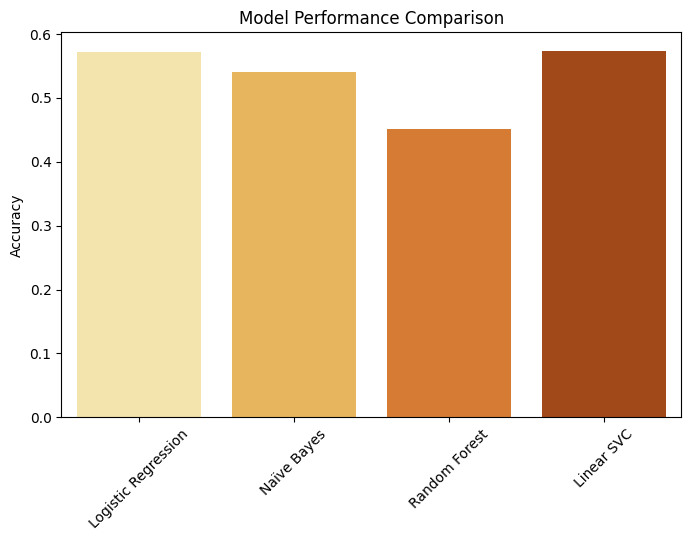

# 🎬 Movie Genre Classifier

Welcome to the **Movie Genre Classifier**! 🚀 This project leverages **Natural Language Processing (NLP)** and **Machine Learning** to classify movies into genres based on their descriptions. 🍿✨

---

## 📌 Project Overview

This repository covers the **end-to-end** process of building a genre classification model, including:

✅ **Data Preprocessing** 🛠️ – Cleaning and preparing text data.  
✅ **Feature Engineering** 🎨 – Extracting meaningful features using TF-IDF and n-grams.  
✅ **Model Training & Tuning** 🤖 – Training multiple models with hyperparameter tuning.  
✅ **Evaluation & Analysis** 📊 – Comparing model performance and visualizing results.  


---

## 📂 Directory Structure

```
📦 Movie Genre Classifier
 ┣ 📂 data
 ┃ ┣ 📂 raw                   # Original dataset
 ┃ ┣ 📂 processed             # Cleaned & transformed data
 ┃ ┗ 📂 models                # Trained models
 ┣ 📂 notebooks               # Jupyter notebooks
 ┣ 📂 models
 ┃ ┗ 📂 saved_models          # Best trained models
 ┣ 📜 README.md               # You are here! 🎯
 ┣ 📜 requirements.txt        # Dependencies
 ┗ 📜 LICENSE                 # License details
```

---

## ⚙️ Installation

1️⃣ Clone this repository:
```bash
git clone https://github.com/your-repo/movie-genre-classifier.git
cd movie-genre-classifier
```

2️⃣ Install dependencies:
```bash
pip install -r requirements.txt
```

3️⃣ Run Jupyter Notebook:
```bash
jupyter notebook
```
4️⃣ Use models:
## 📜 Model & Utility Scripts

### 📌 model.py
**Purpose:**  
The `model.py` file contains essential functions for **loading trained models** and **making predictions** based on movie descriptions.

**Functions:**  
- `load_model(model_path)`: Loads a trained model from a file.  
- `predict_genre(model, description, vectorizer)`: Preprocesses a given movie description, converts it into numerical features, and predicts the genre using the trained model.  

**Usage:**  
This file is meant to be **imported and used** in other scripts (e.g., `utils.py`) to make predictions.  

---

### 📌 utils.py
**Purpose:**  
The `utils.py` file provides a **command-line interface** for users to enter a movie description and receive a predicted genre.

**How It Works:**  
1. **Loads the trained model and vectorizer.**  
2. **Asks the user to enter a movie description.**  
3. **Preprocesses and predicts the genre using `model.py`.**  
4. **Loops until the user types `'exit'`.**  

**Usage:**  
Run the script in a terminal:  
```bash
python utils.py
```
Example interaction:
```bash
Enter a movie description (or type 'exit' to quit): A spaceship crew explores a distant galaxy.
🎥 Predicted Genre: Sci-Fi

Enter a movie description (or type 'exit' to quit): exit
Goodbye! 🎬
```
[](https://www.youtube.com/embed/VsDferYnm4I)

---

## 🛠️ Preprocessing & Feature Engineering

We use **TF-IDF vectorization** with **n-grams** to extract features.  Additionally, **text cleaning** includes:
- Removing special characters, stopwords, and punctuations.
- Lowercasing and tokenization.
- Lemmatization for better feature extraction.

---

## 🚀 Model Training & Hyperparameter Tuning

We trained the following models:
- ✅ **Logistic Regression**
- ✅ **Naïve Bayes**
- ✅ **Random Forest**
- ✅ **Linear SVC** (instead of SVC due to time efficiency)

Hyperparameter tuning was conducted using **GridSearchCV** to optimize performance. 📈🔥

---

## 🎯 Results & Evaluation

Each model's accuracy and classification report were visualized using **heatmaps** and **bar plots**. 📊

- **Best performing model:** 🚀 (TBD based on results)
- **Visualizations include:**
  - Confusion matrices
  - Classification reports
  - Model performance comparison


---

## 📜 License

This project is licensed under the **MIT License**. See the [LICENSE](LICENSE) file for details.

---

## 🤝 Contributing

Contributions are welcome! 🎉 Feel free to open issues or submit pull requests.

---

## 📩 Contact

For any questions or collaboration, reach out via **[your email or GitHub](https://github.com/AarambhaAnta)**! 🚀

